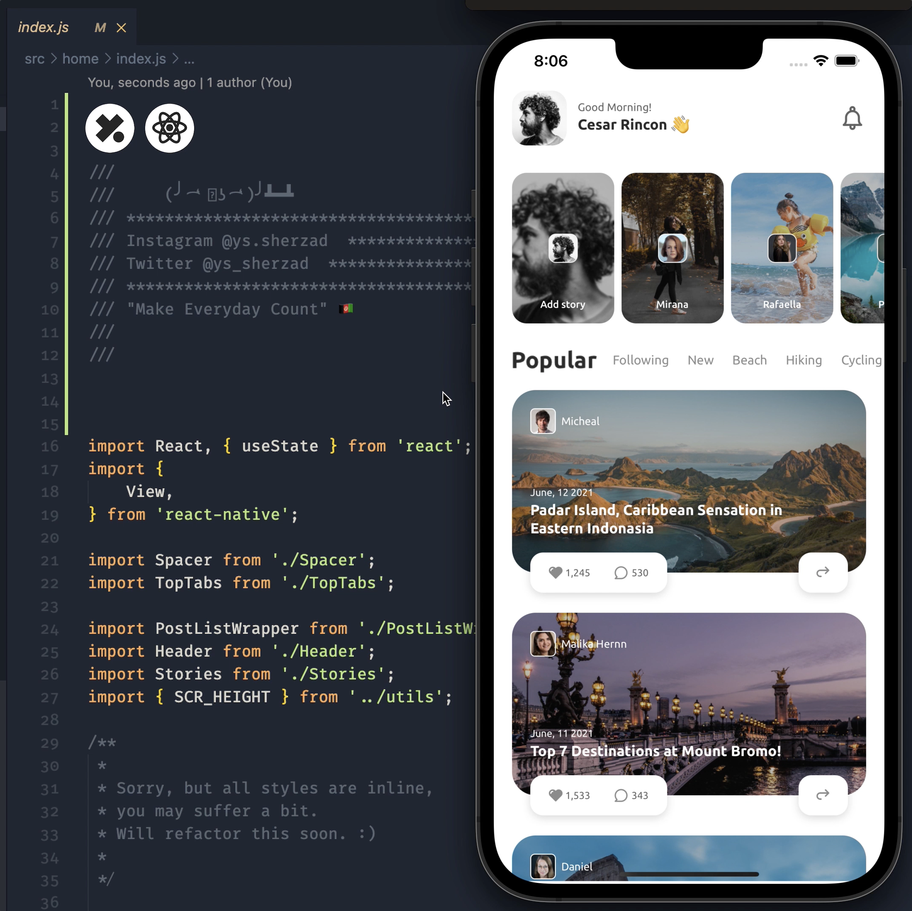

# Wonderland 👑

A travel app concept built using React Native.
Design credits:
[https://www.instagram.com/_ydntkwia/]

Images:
https://unsplash.com/



**Installation**

Clone the repo

```
git clone https://github.com/ys-sherzad/Wonderland.git
```

On your project directory

```
yarn install
or
npm run install
```

Install pods for iOS

```
npx pod-install
```

Run the app

```
yarn ios
or
yarn android
```

Feel free to create an issue if you face any problems running the project.

---

__Brought to you by:__
[Codeys.io](https://codeys.io) 💎 

_Transforming mobile experiences for businesses and developers._
